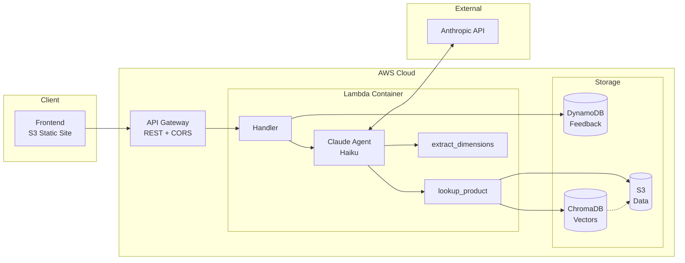

# ASRS Storage Classifier

[](https://github.com/EvieHwang/wm2/actions/workflows/ci.yml)
[](https://github.com/EvieHwang/wm2/actions/workflows/deploy.yml)

An AI-powered product classification system that automatically assigns warehouse storage categories based on text descriptions. Built with Claude API and deployed on AWS serverless infrastructure.

**[Live Demo](http://wm2-asrs-classifier-frontend.s3-website-us-west-2.amazonaws.com/)**

## What It Does

Enter a product description, and the classifier determines the optimal ASRS (Automated Storage and Retrieval System) container type. The system uses Claude's reasoning capabilities combined with optional tool calls to:

1. Look up known products in a reference database (479 items)
2. Extract explicit dimensions from the description using regex patterns
3. Apply constraint-based classification rules

## Classification Categories

| Category | Max Dimensions | Max Weight |
|----------|---------------|------------|
| **Pouch** | 10" × 8" × 2" | 1 lb |
| **Small Bin** | 12" × 10" × 6" | 10 lbs |
| **Tote** | 24" × 16" × 12" | 50 lbs |
| **Carton** | 48" × 36" × 36" | 100 lbs |
| **Oversized** | Exceeds carton limits | — |

## Architecture



**How it works:**
1. User submits a product description via the frontend
2. Lambda retrieves relevant feedback from DynamoDB for few-shot context
3. Claude Agent decides which tools to call (if any) based on the input
4. `lookup_product` uses semantic search (ChromaDB) to find similar products
5. `extract_dimensions` parses explicit measurements from text
6. Claude synthesizes results and returns a classification

## RAG Semantic Search Architecture

The product lookup tool uses Retrieval-Augmented Generation (RAG) with semantic search to find relevant products:


### Semantic Search Flow

1. **Query Embedding**: User query is converted to a 384-dimensional vector using `all-MiniLM-L6-v2`
2. **Vector Search**: ChromaDB performs approximate nearest neighbor search against 479 product embeddings
3. **Hybrid Re-ranking**: Results are boosted by keyword overlap for better precision
4. **Context Injection**: Top matches are passed to Claude as tool results

### Feedback Loop (Few-Shot Learning)

```mermaid
flowchart LR
    subgraph Retrieval["Two-Tier Retrieval"]
        R1[Recent Feedback<br/>Last 10 entries]
        R2[Keyword Match<br/>Semantic relevance]
    end

    subgraph Context["Prompt Context"]
        FS[Few-Shot Examples]
    end

    DDB[(DynamoDB)] --> R1
    DDB --> R2
    R1 --> FS
    R2 --> FS
    FS --> CL[Claude Agent]

    CL -->|Classification| U[User]
    U -->|👍/👎| DDB
```



Feedback from users (thumbs up/down) is stored in DynamoDB and retrieved for future classifications, enabling the model to learn from corrections over time.

## Feedback Memory

The system learns from user feedback to improve classification accuracy over time:

- **Thumbs up/down**: Users can mark classifications as correct or incorrect
- **Stored in DynamoDB**: Feedback persists globally across all users
- **Few-shot learning**: Relevant feedback is injected into Claude's prompt as examples
- **Two-tier retrieval**: Combines recent feedback + keyword-matched historical entries

## Tech Stack

- **Backend**: Python 3.12, AWS Lambda, API Gateway, SAM, DynamoDB
- **Frontend**: Vanilla HTML/CSS/JavaScript, S3 static hosting
- **AI**: Claude API (Anthropic) with native tool use
- **Data**: CSV reference database with 479 known products

## CI/CD Pipeline

This project uses GitHub Actions for continuous integration and deployment:

- **CI**: Runs on all PRs and pushes to main (lint, test, security scan, dependency audit)
- **Deploy**: Automatically deploys to AWS on merge to main

### Required GitHub Secrets

To enable automated deployment, configure these secrets in your GitHub repository:

| Secret | Description |
|--------|-------------|
| `AWS_ACCESS_KEY_ID` | AWS IAM access key with Lambda, ECR, S3, CodeBuild permissions |
| `AWS_SECRET_ACCESS_KEY` | AWS IAM secret key |
| `ANTHROPIC_API_KEY` | Anthropic API key for running tests |

### Manual Deployment

Prerequisites: AWS CLI configured, SAM CLI installed, Anthropic API key

```bash
# Backend
cd backend
sam build
sam deploy --guided --parameter-overrides AnthropicApiKey=your-key

# Frontend (update API_BASE_URL in app.js first)
aws s3 mb s3://your-bucket-name
aws s3 website s3://your-bucket-name --index-document index.html
aws s3 sync ../frontend s3://your-bucket-name
```

## License

MIT License - See [LICENSE](LICENSE) for details.
