# ASRS Classifier Agent Flow

```mermaid
flowchart TD
    A[/"User Input<br/>(Product Description)"/] --> B["Claude Agent<br/>(Sonnet 3.5)"]

    B --> C{"Needs<br/>Tool Calls?"}

    C -->|"Known product name"| D["🔍 lookup_known_product<br/>Search 479-item reference DB"]
    C -->|"Has dimensions in text"| E["📏 extract_explicit_dimensions<br/>Regex pattern matching"]
    C -->|"Sufficient context"| F

    D --> F{"Apply Category<br/>Constraints"}
    E --> F

    F --> G["Classification Result"]

    G --> H[/"Output:<br/>Category + Confidence + Reasoning"/]

    subgraph Tools ["Optional Tools (tool_choice=auto)"]
        D
        E
    end

    subgraph Categories ["Storage Categories"]
        I["📦 Pouch<br/>≤10×8×2 in, ≤1 lb"]
        J["📦 Small Bin<br/>≤12×10×6 in, ≤10 lbs"]
        K["📦 Tote<br/>≤24×16×12 in, ≤50 lbs"]
        L["📦 Carton<br/>≤48×36×36 in, ≤100 lbs"]
        M["📦 Oversized<br/>Exceeds limits"]
    end

    F -.-> Categories

    style A fill:#e1f5fe
    style B fill:#fff3e0
    style C fill:#fff9c4
    style F fill:#fff9c4
    style G fill:#c8e6c9
    style H fill:#c8e6c9
    style D fill:#f3e5f5
    style E fill:#f3e5f5
```

## Flow Description

1. **User Input**: Product description text (up to 2000 characters)
2. **Claude Agent**: Analyzes the description and decides whether tools are needed
3. **Tool Decision**:
   - If product name is recognized → calls `lookup_known_product`
   - If dimensions are mentioned → calls `extract_explicit_dimensions`
   - If sufficient context exists → skips tools
4. **Constraint Application**: Matches dimensions/weight against category thresholds
5. **Output**: Returns category, confidence score (0-100), and reasoning
